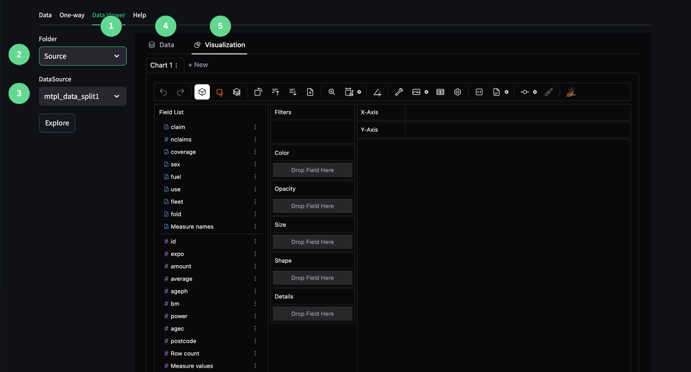

1. Data viewer tab
2. The Folder dropdown list where you can choose which folder they would like to choose a dataset from. 
3. The Datasource dropdown list where you can choose which datasource you would like to build one-way visualisations from. 
4. Data tab that opens the data profiler. 
5. Visualization tab that opens the data visualisation tab.

## User Guide

For the data viewer we use the open source PyGWalker. 
For more information on the library, please see the following: https://docs.kanaries.net/pygwalker

Please the below tutorial video on how to use the data viewer. 

<iframe
  width="560"
  height="315"
  src="https://www.youtube.com/embed/rprn79wfB9E?start=138"
  title="YouTube video player"
  frameBorder="0"
  allow="accelerometer; autoplay; clipboard-write; encrypted-media; gyroscope; picture-in-picture"
  allowFullScreen
  style={{ width: '100%', borderRadius: '0.5rem' }}
></iframe>

In the future we are playing to additional tutorials on how to use the dataviewer for actuarial/rating data analysis. 
Watch this space.   

