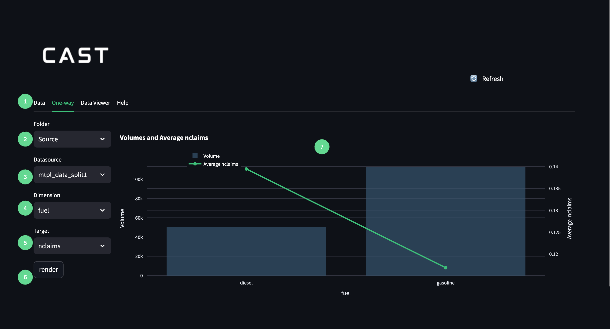

- 1: One-way tab that opens the one way visualisation viewer. 
- 2: The Folder dropdown list where you can choose which folder they would like to choose a dataset from. 
- 3: The Datasource dropdown list where you can choose which datasource you would like to build one-way visualisations from. 
- 4: The Dimension dropdown list where you can use the column in the chosen dataset that will be visualised on the x-axis of the one-way visualisation. 
- 5: The Target dropdown list where you can choose the column in the chosen dataset that will be visualised on the secondary y-axis. 
- 6: The render button will render the one-way visualisation once all the above parameters have been selected. 
- 7: The one-way visualisation where you can do checks and inspect the selected data. 

## User Guide

### Step 1

- Select the Folder and Data Source from which you would like to build the one-way visualisation. 

### Step 2

- Select the Dimension (x-axis) and Target (y-axis) that you would like to by visualised. 

### Step 3

- Render and Inspect the visualisation

### Step 4

- Repeat steps 2 and 3 in order to check each column. 

## Frequently Asked Questions (FAQs)

