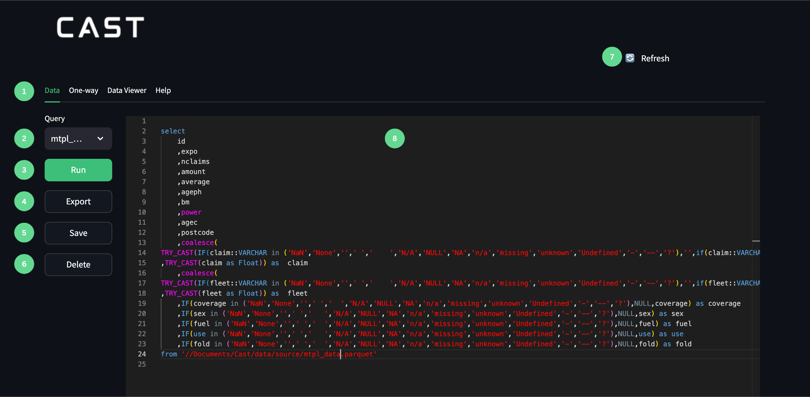
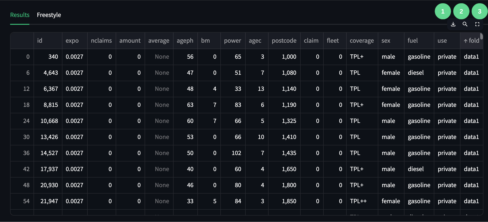

1. Data tab that will open the query editor.
2. Dataset drop down menu from which the dataset for the generic query can be selected. 
3. Run button that will run the query in the editor. 
4. Export button that will export the output of the query to a Parquet file that can be found in the export folder in the Cast directory.  
5. Save button that will save the query and can then be found in the query folder in the Cast directory. 
6. Delete button that will delete the query from the directory. 
7. Refresh button that can be used to refresh the directory if new data has been added. 
8. Query Editor in which a SQL query can be written. 

1. Download button
2. Search button
3. Expansion button

## User Guide:

### Step 1: Select Dataset
- Open the dropdown menu in the left sidebar.
- Choose the desired dataset.
- A pre-populated query will automatically populate the query editor.

### Step 2: Write Query
- Modify the pre-populated query or write a new DuckDB SQL query.
- Customise the query to extract specific data or perform desired analysis.

### Step 3: Execute Query
- Click the "Run" button in the left sidebar.
- A results table will appear below the query editor.

### Step 4: Analyze Results
- Review the generated data table
- Utilise table features:
  - Enlarge table using the expansion button (top right).
  - Download table as CSV.
  - Search specific data using the search function.

### Step 5: Iterate
- Repeat steps 2-4 to refine your query.
- Continue until you achieve the desired data output.

### Step 6: Save and Export

- Click "Save" in the left sidebar to store your query.
- Use "Export" button to save output as a Parquet file.

## Frequently Asked Questions:

- How do I query multiple different flat files in one query?
    - To query a flat file you will only need to reference the file path where it is stored. 
    - As a example use the file path generated from the pre-populated query and substitute the file name. 

- Is it possible to create a temporary table in the query editor or will I have to embed all of the tables?
    -You are welcome to embed tables but the best approach may be to use CTE's. 

